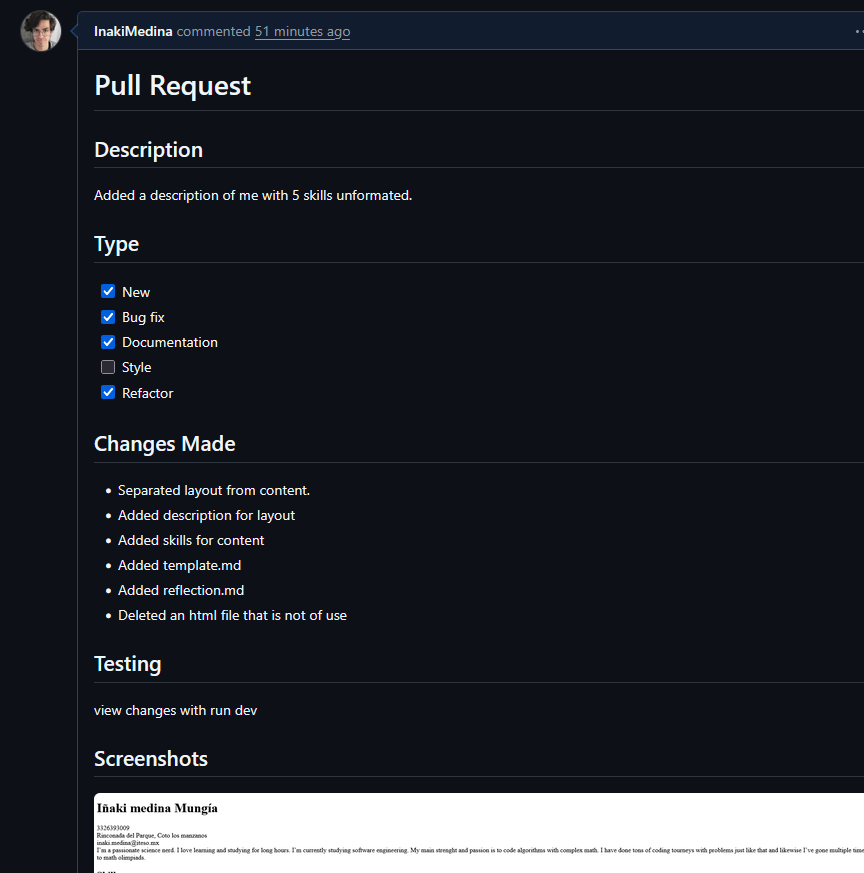
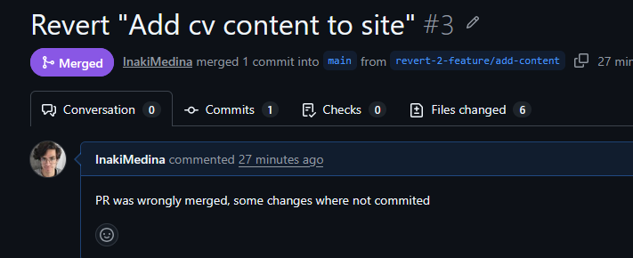
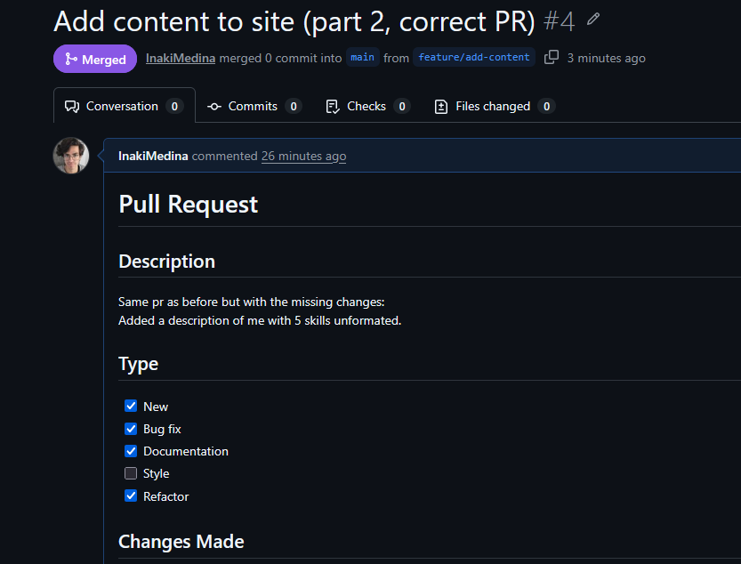
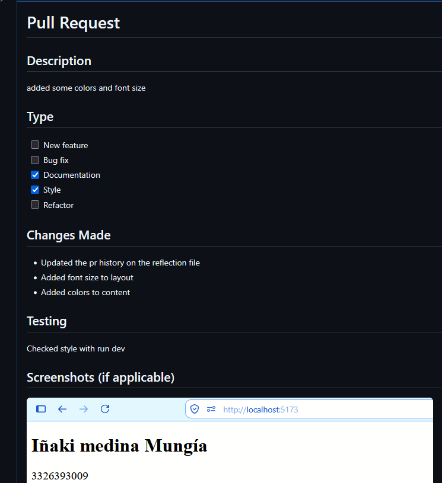

first PR: 
feature/initial-structure -> main
https://github.com/InakiMedina/git-workflow-practice/pull/1

second PR
feature/add-content -> main
https://github.com/InakiMedina/git-workflow-practice/pull/2

note: in second pr, i forgot to push two commits, so i tried to revert second pr. Which was a very bad idea. 

third PR
revert second PR
https://github.com/InakiMedina/git-workflow-practice/pull/3

fourth PR
feature/add-content -> main (redo second PR)
https://github.com/InakiMedina/git-workflow-practice/pull/4

note: this pr was never accepted, since the main had reverted to a wrong commit and both branches couldn't be merged. To fix this, i reseted the feature branch to the correct commit and the reseted main to the feature branch

fifth PR
feature/add-style -> main 
https://github.com/InakiMedina/git-workflow-practice/pull/5

What challenges did you face?
The revert pr thing, was challenging

What Git commands did you find most useful?
rebase was really cool

How will you apply this workflow in the team project?
better commit messages

